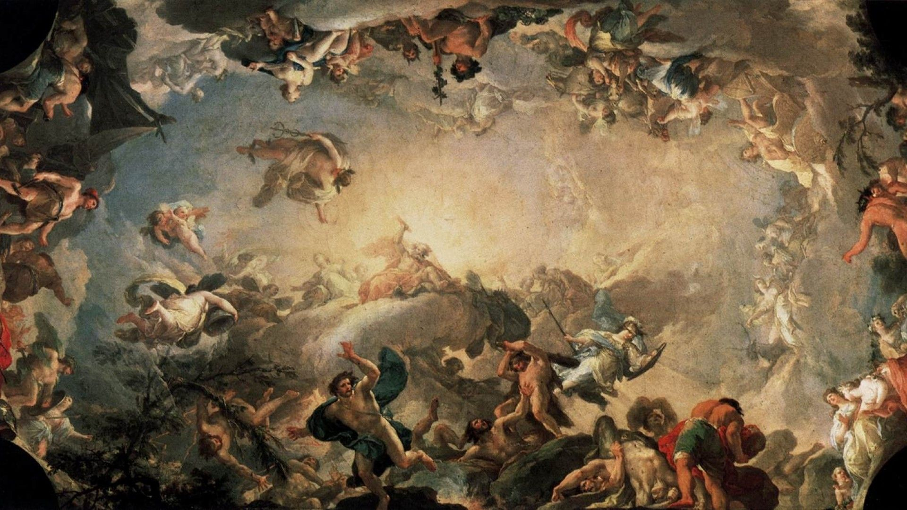
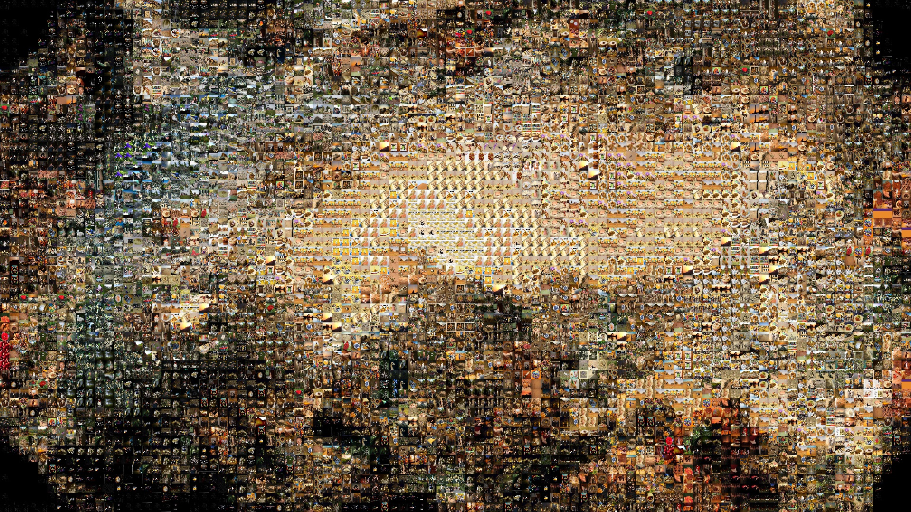

# MosaicPicture
This is an image manipulation project implemented in Python.

## Example
mosaic.py reads an image then replaces each 20x20 segment with a 20x20 image from the image_data folder. Below is a demonstration of the current capabilities of the program.
 
 

Original image
 
 

Manipulated image
 
 

This takes an image and replaces each 20x20 pixel square with a smaller image to emulate the mosaic effect shown here: https://www.picturemosaics.com/photomosaics/id/14
